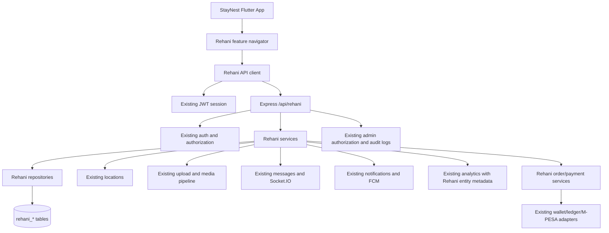
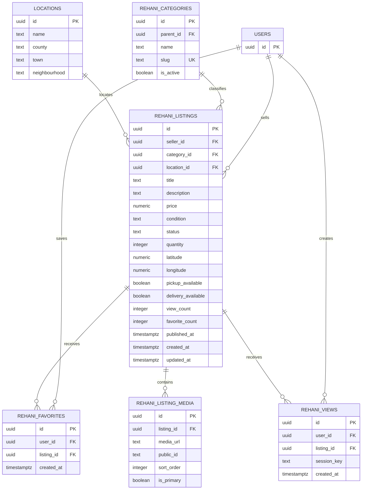
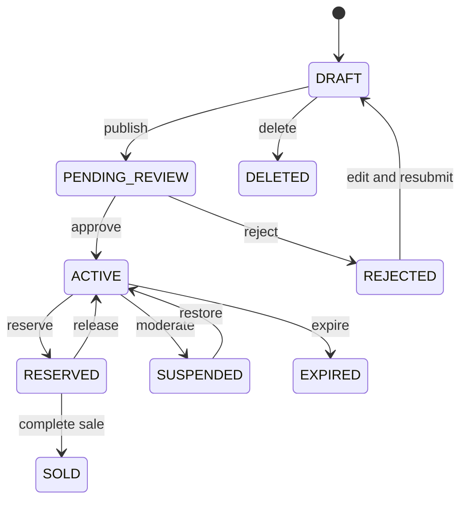
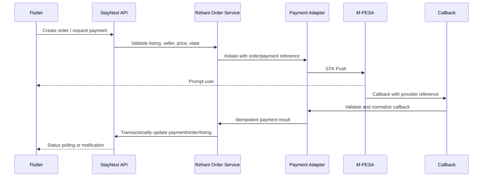

# Rehani Marketplace Integration Audit

**Project:** StayNest  
**Date:** 2026-09-14  
**Scope:** Read-only audit and implementation plan. No Rehani production feature code or database schema was changed during this audit.

## Executive Summary

Rehani should be implemented as a bounded marketplace domain inside StayNest, not as a second application. StayNest already has reusable authentication, PostgreSQL access, location search, uploads, Cloudinary/local media storage, Socket.IO messaging, Firebase notifications, analytics, M-PESA, wallet/escrow, admin, caching, and Flutter UI infrastructure.

The safest integration is:

- Add Rehani-specific tables, models, routes, services, repositories, and screens.
- Reuse `users` for identity and ownership.
- Reuse upload/media, location, messaging, notifications, analytics, and finance infrastructure through explicit Rehani references.
- Do not add marketplace fields to `properties` or represent marketplace orders as housing `bookings`.
- Implement discovery and seller workflows first. Keep orders and payments behind feature flags until their state transitions and callbacks are tested.

The most important pre-work is not a Rehani feature: the existing migration, HTTP-client, transaction, authentication-refresh, and payment-correlation patterns need guardrails before they are reused by commerce functionality.

## A. Existing Architecture Audit

### Backend bootstrap and routing

- [backend/src/index.ts](../backend/src/index.ts) creates the HTTP server, attaches Socket.IO, starts cron jobs, and starts media/email workers.
- [backend/src/app.ts](../backend/src/app.ts) configures Express middleware, JSON parsing, CORS, request logging, rate limiting, static files, error handling, and route registration.
- The API prefix is `/api`.
- Existing route groups include auth, properties, promotions, payments, landlord, locations, wallet, drafts, users, uploads, verifications, notifications, messages, bookings, analytics, admin, tenant profiles, privacy, and version.
- [backend/src/config.ts](../backend/src/config.ts) owns runtime configuration. The backend default port is `8080`; the inspected M-PESA callback default uses port `3000`, which must be reconciled before production payments.

### Authentication and authorization

- [backend/src/middleware/auth.ts](../backend/src/middleware/auth.ts) provides `requireAuth` and `authorize(...)`.
- JWT claims populate `req.auth` with user ID, email, role, and verification state.
- Admin aliases are `admin`, `super_admin`, and `administrator`.
- [backend/src/routes/auth.ts](../backend/src/routes/auth.ts) handles registration, login, refresh, verification, and email changes.
- Registration currently supports `tenant`, `landlord`, and `host`. Rehani should not create buyer/seller accounts. Existing users are buyers and sellers; seller profile data should be additive.
- There is legacy JavaScript authentication/refresh code in [backend/src/services/auth_service.js](../backend/src/services/auth_service.js) and [backend/src/services/auth_controller.js](../backend/src/services/auth_controller.js), while the active TypeScript route has a separate refresh flow. Rehani should use one documented token lifecycle and must not add another.

### Database access and transactions

- [backend/src/db.ts](../backend/src/db.ts) exports the shared PostgreSQL pool, `query<T>()`, and `withAppUser(...)` for the `app.current_user_id` setting used by row-level security.
- The main schema is [backend/scripts/init-db.sql](../backend/scripts/init-db.sql), with additional scripts for bookings, location taxonomy, locations, notifications, property extras, and refresh tokens.
- Several routes issue `BEGIN`/`COMMIT` through the pool instead of holding one `PoolClient`. That is unsafe for multi-step state changes and must be corrected in any Rehani order, offer, payment, or moderation transaction.
- `withAppUser(...)` is not consistently visible in route flows. Rehani authorization must be enforced in service code and SQL predicates, with RLS context set consistently where applicable.

### Existing database entities

Relevant existing tables include:

- Identity: `users`, `refresh_tokens`
- Housing: `properties`, `property_drafts`, `favorites`, `bookings`, `property_availability`
- Trust: `verifications`, `reviews`, `review_reports`
- Communication: `messages`, `message_reads`
- Finance: `payment_transactions`, `booking_escrows`, `wallet_transactions`, `wallet_withdrawals`, `landlord_payment_methods`
- Notifications: `notifications`
- Analytics: `engagement_events`, `property_analytics`, `property_unique_views`, `search_events`, `user_engagement_profiles`
- Configuration/admin: `promotions`, `promotion_campaigns`, `platform_settings`, `user_preferences`, `admin_audit_logs`
- Location: `locations`

Migration concerns:

- Notifications and refresh tokens are maintained in separate SQL scripts and are not clearly part of one ordered migration system.
- Existing SQL scripts overlap with `init-db.sql`.
- There is no formal migration version table or rollback workflow visible in the inspected structure.
- Rehani should introduce versioned, ordered migrations and document the deployment command before adding its tables.

## B. Reusable Infrastructure

| Capability | Existing implementation | Rehani use |
|---|---|---|
| Identity/auth | `auth.ts`, `auth` middleware, `AppSession` | Existing users, JWT, ownership and role checks |
| Database | PostgreSQL pool and typed query helper | New `rehani_*` tables and repositories |
| Location | `locations` table, `/api/locations/search`, taxonomy scripts | Category/location discovery, coordinates, neighbourhood search |
| Media | `uploads.ts`, Cloudinary, local fallback, BullMQ media worker | Listing images, metadata, ordering, ownership |
| Messaging | `messages.ts`, `SocketService`, Socket.IO user rooms | Buyer/seller conversations with listing context |
| Notifications | Firebase service, notification queue, persisted notifications | Listing, offer, moderation, and order events |
| Analytics | analytics route and `AnalyticsService` | Rehani event names and entity dimensions |
| Payments | M-PESA service, wallet, ledger, escrow | Future explicit Rehani orders/payments, not booking/boost reuse |
| Admin | `/api/admin`, superadmin shell/service, audit logs | Moderation, reports, seller and category management |
| Flutter networking | `HttpJsonClient`, repository pattern, cache engine | Typed `RehaniApi` and feature repositories |
| Flutter media/location | upload services, image widgets, map/geolocation | Listing creation, discovery, and product detail |

## C. Current Conflicts and Risks

1. **Rental coupling:** Property routes, favorites, reviews, promotions, and analytics assume housing properties and should not become generic by accident.
2. **Multiple HTTP layers:** `ApiClient`, `HttpJsonClient`, repository calls, and direct HTTP calls have inconsistent authentication and error behavior. Rehani should use `HttpJsonClient` only.
3. **Transaction safety:** Pool-level transaction statements can cross connections. Rehani state transitions require one checked-out client and database constraints.
4. **Refresh-token divergence:** Active TypeScript and legacy JavaScript auth flows need one documented owner.
5. **Migration drift:** Additive Rehani SQL should not become another unversioned script collection.
6. **Payment correlation:** Existing M-PESA flows include domain-specific boost/booking behavior. Rehani payment callbacks must reference an exact payment/order, not infer the latest pending record.
7. **Socket authorization:** Unauthenticated sockets can connect and signaling authorization is not domain-specific. Listing-linked chat and calls need permission checks.
8. **Endpoint mismatch:** Existing Flutter booking code references `/landlord/bookings` while the active backend route is `/bookings/landlord`; Rehani should establish contract tests to prevent this pattern.
9. **Analytics coupling:** Existing backend analytics validates `propertyId`; Rehani needs `entity_type/entity_id` or an isolated event table.
10. **Testing gap:** Backend tests are not configured; Flutter tests cover session and housing utilities but not payment, socket, notification, upload, admin, or database contracts.

## D. Proposed Architecture



### Bounded context rule

Rehani owns listing, category, offer, order, moderation, and marketplace review behavior. Existing StayNest owns users, authentication, location taxonomy, media processing, messaging transport, notifications, analytics transport, and finance adapters.

A Rehani entity must be identifiable without pretending to be a housing property. Use explicit IDs and references such as `listing_id`, `order_id`, `offer_id`, and `entity_type = 'rehani_listing'`.

## E. Conceptual Database Schema

### Phase 1 foundation tables



### Phase 2 and later tables

Add only when the preceding workflow is tested:

- `rehani_seller_profiles`: public seller metadata, verification status, rating aggregates.
- `rehani_offers`: buyer, seller, listing, amount, message, and explicit state transitions.
- `rehani_reports`: reporter, listing/seller target, category, status, moderator decision.
- `rehani_conversations` or a listing-context table if the existing `messages` model cannot safely carry a listing reference.
- `rehani_orders` and `rehani_order_items`: agreed prices captured at purchase time.
- `rehani_payments`: exact order reference, provider reference, idempotency key, status, and failure data.
- `rehani_reviews`: tied to a completed order or explicitly approved interaction, with duplicate-review constraints.
- `rehani_order_events`: append-only state transition audit trail.

### Constraints and indexes

- Foreign keys to `users`, `locations`, and Rehani tables.
- Unique `(user_id, listing_id)` on favorites.
- Unique category slug and controlled parent hierarchy.
- Check constraints for non-negative price and quantity.
- Controlled status values or enum tables, with service-level transition validation.
- Indexes on `(status, created_at)`, `seller_id`, `category_id`, `location_id`, `price`, and coordinates/search combinations used by real queries.
- Never trust seller ID, buyer ID, price, or payment status from Flutter; derive identity and authoritative values server-side.

## F. Listing and State Machines

### Listing lifecycle



No general-purpose `PATCH status` endpoint should accept arbitrary statuses. Services must define allowed transitions and authorize each transition.

### Order lifecycle (future commerce phase)

`PENDING_PAYMENT -> PAID -> PROCESSING -> READY_FOR_PICKUP/OUT_FOR_DELIVERY -> COMPLETED`, with explicit `PAYMENT_FAILED`, `CANCELLED`, and refund states. Every transition should be transactional and recorded in `rehani_order_events`.

## G. Migration Plan

1. Decide and document the migration runner/version table. Do not add another standalone SQL file without ordering and applied-state tracking.
2. Add a migration for categories and `rehani_listings` with UUIDs, ownership, status, price, location, and timestamps.
3. Add listing media and favorites with foreign keys and uniqueness constraints.
4. Add indexes based on the first query plan, not speculative indexes.
5. Seed categories using stable slugs, never hardcoded Flutter IDs.
6. Add offers/reports/seller profiles only when seller workflows are ready.
7. Add order, item, payment, and event tables only when commerce is approved.
8. Provide a reversible down strategy where safe, and document irreversible production operations.
9. Run schema checks against a disposable database and verify existing housing tables are unchanged.

## H. Backend Changes Required

### Suggested module boundary

```text
backend/src/modules/rehani/
  controllers/
  dto/
  repositories/
  routes/
  services/
  types/
  validators/
  utils/
```

If the current repository does not use modules consistently, a smaller additive surface is acceptable, but business logic should still be outside route handlers.

### Initial API contract

All responses should follow the existing StayNest envelope and error format.

| Method | Endpoint | Auth | Purpose |
|---|---|---:|---|
| GET | `/api/rehani/categories` | No | Active category tree |
| GET | `/api/rehani/listings` | Optional | Paginated discovery with keyword/category/price/location/distance/sort |
| GET | `/api/rehani/listings/:id` | Optional | Detail, media, seller summary |
| POST | `/api/rehani/listings` | Yes | Create draft/listing; seller from JWT |
| PATCH | `/api/rehani/listings/:id` | Yes | Owner edits allowed fields |
| POST | `/api/rehani/listings/:id/publish` | Yes | Submit for moderation |
| DELETE | `/api/rehani/listings/:id` | Yes | Owner/admin soft delete |
| POST | `/api/rehani/listings/:id/favorite` | Yes | Add favorite |
| DELETE | `/api/rehani/listings/:id/favorite` | Yes | Remove favorite |
| GET | `/api/rehani/favorites` | Yes | Current user saved listings |
| POST | `/api/rehani/listings/:id/view` | Optional | De-duplicated view event |
| GET | `/api/rehani/sellers/:id` | Optional | Public seller profile |
| POST | `/api/rehani/listings/:id/offers` | Yes | Create buyer offer |
| PATCH | `/api/rehani/offers/:id` | Yes | Accept, decline, counter, cancel with authorization |
| POST | `/api/rehani/reports` | Yes | Report listing/seller |

Do not expose order/payment endpoints until their backend state machine and callback tests exist.

### Validation and authorization

- Validate DTOs server-side for title, description, price, condition, category, media count, coordinates, and delivery flags.
- Derive `seller_id`, `buyer_id`, and user identity from `req.auth`.
- Enforce ownership in SQL and service code.
- Verify listing status before favorites, offers, edits, and sale operations.
- Apply rate limits to listing creation, views, reports, offers, and messaging initiation.
- Keep admin moderation behind existing admin authorization and write audit entries.

## I. Flutter Changes Required

### Feature structure

```text
frontend/lib/features/rehani/
  data/
    rehani_api.dart
    rehani_repository.dart
  models/
    rehani_listing.dart
    rehani_category.dart
    rehani_offer.dart
    rehani_seller.dart
  screens/
    rehani_home_screen.dart
    rehani_search_screen.dart
    rehani_listing_detail_screen.dart
    rehani_favorites_screen.dart
    rehani_sell_screen.dart
    rehani_my_listings_screen.dart
  widgets/
    rehani_product_card.dart
    rehani_category_chip.dart
    rehani_image_gallery.dart
  state/
    rehani_controller.dart
```

The exact state layer should follow the existing project style: StatefulWidgets, singleton services, and local controllers are currently used. Do not introduce Riverpod/Bloc only for Rehani without a deliberate architecture decision.

### Navigation

- Add `/rehani` to the existing named-route map in [frontend/lib/main.dart](../frontend/lib/main.dart).
- Wire the existing Rehani promotional card in [frontend/lib/screens/home/home_view.dart](../frontend/lib/screens/home/home_view.dart) to `/rehani`.
- Keep housing routes unchanged.
- Use a feature-level navigator or route helper once Rehani has more than a few pages, while retaining the existing authentication guard.
- Do not expose checkout, orders, or payment UI during discovery phases.

### API and state rules

- Use `HttpJsonClient` and typed DTO parsing.
- Reuse the existing cache engine with Rehani-specific keys.
- Implement loading, empty, error, offline, pagination, and partial-image states.
- Use the existing Poppins typography, colors, cards, image widgets, icons, spacing, and loading patterns.
- Do not reuse the rental `Property` model as a marketplace product model.
- Track Rehani analytics through explicit event names and listing IDs.

### Initial user-facing pages

Phase 2 should contain only:

1. Rehani home/discovery.
2. Search and filters.
3. Category results.
4. Product detail.
5. Favorites.

Phase 3 adds create/edit listing, my listings, seller profile, reports, and moderation status. Offers come in Phase 4. Orders and payments come later.

## J. Media and Location Integration

### Media

Reuse [backend/src/routes/uploads.ts](../backend/src/routes/uploads.ts), [backend/src/services/storage.ts](../backend/src/services/storage.ts), Cloudinary integration, BullMQ processing, and Flutter compression/upload services.

Required changes:

- Associate each uploaded media record with a Rehani listing only after ownership is verified.
- Store secure URL, provider/public ID, ordering, primary-image flag, dimensions/type where available, and processing status.
- Enforce maximum count, file size, MIME type, and image dimensions server-side.
- Clean up failed/orphaned uploads through a scheduled job or explicit listing deletion workflow.
- Never accept arbitrary media URLs from the client as trusted listing media.

### Location

Reuse `locations`, `/api/locations/search`, location taxonomy, geolocation, map, and distance-query patterns.

Required changes:

- Accept a location ID when it matches an existing taxonomy entry.
- Store coordinates only when validated and associated with the listing owner’s submitted location.
- Support keyword plus category, price, location, and radius filters.
- Use existing Postgres capabilities after checking whether PostGIS is installed; do not introduce PostGIS without an operational need.
- Avoid exposing exact private seller addresses. Return an appropriate neighbourhood/town-level public location.

## K. Messaging, Notifications, and Analytics

### Messaging

Reuse `messages.ts`, [frontend/lib/services/message_service.dart](../frontend/lib/services/message_service.dart), [frontend/lib/services/socket_service.dart](../frontend/lib/services/socket_service.dart), and the existing chat UI.

Add listing context using either:

- A Rehani conversation record linked to the existing conversation/user pair, or
- Explicit nullable `rehani_listing_id` metadata in a backward-compatible message context table.

Do not create a second socket server or message persistence system. Before enabling marketplace calls, authorize that the participants may contact each other and that signaling is associated with an allowed conversation.

### Notifications

Reuse the notification database, queue, Firebase service, and Flutter notification APIs. Add typed payload fields such as `listing_id`, `offer_id`, `order_id`, and `conversation_id`. Notification types should include listing approval/rejection, new offer, counter offer, offer decision, new product message, item sold, and order state changes when commerce exists.

### Analytics

Reuse Firebase and backend analytics transport, but do not force Rehani IDs into `propertyId`. Prefer a generic event payload:

```json
{
  "event": "rehani_listing_viewed",
  "entity_type": "rehani_listing",
  "entity_id": "uuid",
  "metadata": {"category": "electronics", "source": "nearby"}
}
```

Views must be de-duplicated and paginated discovery must not produce excessive synchronous writes.

## L. Payments and Commerce Architecture

Payments are Phase 5 only.



Rules:

- Flutter never receives M-PESA credentials.
- Flutter never declares payment success.
- `rehani_payments` must reference one order and have a unique idempotency key/provider reference.
- Callback handling must be replay-safe and validate amount, order, user, and provider reference.
- Capture agreed item prices in `rehani_order_items`; never recalculate historical order totals from the live listing.
- Reuse M-PESA, wallet, ledger, and escrow adapters, but do not represent Rehani orders as `boost` or housing `booking` records.
- Review the legal/business model for marketplace custody, refunds, settlement, and seller payouts before production enablement.

## M. Admin and Moderation Integration

Extend the existing admin system rather than creating another app.

Backend additions under `/api/admin/rehani` should cover:

- Overview counts.
- Pending/active/suspended/deleted listings.
- Listing approval, rejection, suspension, and restoration.
- Seller profile/verification review.
- Reports and decisions.
- Category management.
- Offers, disputes, refunds, and payments when those phases exist.

Flutter additions should be new pages inside the existing superadmin shell and service. Every moderation action should record actor, target, previous state, new state, reason, and timestamp in existing audit infrastructure.

## N. Rollout and Feature Flags

Recommended flags:

- `REHANI_MARKETPLACE_ENABLED`
- `REHANI_SELLING_ENABLED`
- `REHANI_OFFERS_ENABLED`
- `REHANI_ORDERS_ENABLED`
- `REHANI_PAYMENTS_ENABLED`

Rollout sequence:

1. Deploy schema and backend endpoints disabled.
2. Enable read-only categories/listings for internal users.
3. Enable discovery for a controlled cohort.
4. Enable seller drafts and moderation.
5. Enable offers after notification and messaging tests.
6. Enable orders/payments only after callback, idempotency, ledger, and reconciliation tests.
7. Monitor errors, latency, moderation backlog, upload failures, and payment reconciliation.
8. Keep a rollback switch that hides Rehani UI without deleting data.

## O. Testing Strategy

### Database

- Migration applies cleanly to an existing database.
- Foreign keys, unique favorites, status checks, and indexes work.
- Duplicate favorite and concurrent offer cases are safe.
- Existing housing tables and queries remain unchanged.

### Backend

- Public listing/category reads.
- Authenticated create/edit/delete ownership.
- Admin moderation authorization.
- DTO validation and sanitized errors.
- Pagination, filters, keyword search, distance search, and sort.
- Media ownership, MIME/size limits, orphan cleanup.
- Offer state transitions and race conditions.
- Notification enqueue and payload contract.
- Socket participant authorization.
- Order/payment idempotency, amount mismatch, callback replay, timeout, failure, refund, and reconciliation.
- Use a real backend test runner; the current package test command reports no configured backend tests.

### Flutter

- Rehani model parsing and API response contracts.
- Loading, empty, error, offline, pagination, and image failure states.
- Navigation from the existing home promotional card.
- Authentication guard and ownership flows.
- Favorite/unfavorite behavior.
- Create/edit validation.
- Offer and order state rendering when those phases ship.
- Existing Flutter tests and housing flows remain passing.

### Operational checks

- Run static analysis and unit tests after each phase.
- Test with a disposable database and a device/emulator.
- Verify logs do not include tokens, passwords, payment credentials, or private addresses.
- Verify feature flags can disable Rehani without affecting home, auth, bookings, messaging, notifications, or profile flows.

## P. Implementation Phases

### Phase 0: Audit and prerequisites

- Confirm migration runner and add migration version tracking.
- Decide the canonical auth refresh flow.
- Document transaction helper using one `PoolClient`.
- Add API contract test foundation.
- Decide generic analytics entity representation.
- Resolve backend port and callback configuration mismatch.

### Phase 1: Foundation

- Add categories, listings, media, favorites, and optional view tables.
- Add typed backend validators/services/repositories.
- Add category/listing/favorite APIs.
- Add Flutter models, API layer, cache keys, and feature route.
- Keep listing creation behind a flag until moderation is available.

### Phase 2: Discovery

- Rehani home, search, filters, nearby results, category results, product detail, favorites.
- Wire the existing home promotional card.
- Add analytics and image failure/empty/offline states.

### Phase 3: Seller and moderation

- Seller drafts, media association, create/edit/delete, my listings, seller profile, reports.
- Admin moderation pages and audit logs.

### Phase 4: Communication and offers

- Listing-linked chat context using existing Socket.IO/messages.
- Offers and counteroffers with explicit transitions.
- Notifications and authorization tests.

### Phase 5: Commerce

- Orders, order items, payment records, payment service adapter, M-PESA callback idempotency, escrow/ledger settlement, seller payouts.
- Expose UI only after backend integration and reconciliation tests pass.

### Phase 6: Trust and growth

- Reviews tied to completed transactions, seller verification, recommendations, saved searches, alerts, delivery integrations, and richer analytics.

## Q. Required Changes by Existing Area

| Area | Keep | Modify/add |
|---|---|---|
| Auth | Existing users/JWT/session | Canonical refresh documentation; Rehani ownership guards |
| Housing | Properties, bookings, existing routes | No Rehani fields or lifecycle coupling |
| Database | Shared PostgreSQL | Versioned `rehani_*` migrations and constraints |
| API | Existing response envelope | `/api/rehani` route/service boundary |
| Media | Cloudinary/local/BullMQ | Listing media ownership and metadata |
| Location | Taxonomy/search/maps | Rehani filters and privacy-safe public location |
| Messaging | REST messages/Socket.IO | Listing context and participant authorization |
| Notifications | Queue/FCM/database | Rehani event types and payload fields |
| Analytics | Firebase/backend transport | Generic entity metadata or Rehani event table |
| Finance | M-PESA/wallet/ledger adapters | Explicit Rehani order/payment aggregates and idempotency |
| Admin | Existing superadmin shell/audit | Rehani moderation and commerce operations |
| Flutter | Existing named routes/theme/widgets | `features/rehani`, typed API/repository, isolated screens |

## R. Success Criteria

An existing authenticated StayNest user can open Rehani from the current home screen, browse paginated nearby items, search/filter by category/price/location, open a product detail, view a privacy-safe seller profile, favorite a listing, contact the seller, and later make a controlled offer. Commerce is enabled only after explicit order/payment state and callback verification.

All existing housing functionality must continue working: login, registration, housing discovery, property listing, favorites, bookings, messaging, notifications, analytics, profile, and admin navigation.

## S. Recommended Approval Gate

Approve Phase 0 and Phase 1 only after confirming:

- The migration strategy and deployment command.
- Whether Rehani uses a generic analytics entity model or an isolated analytics table.
- Whether listing media is persisted in a new Rehani media table or an extension of existing upload metadata.
- The seller moderation policy and prohibited-item rules.
- The legal/payment model for marketplace custody, refunds, settlement, and payouts.
- The desired initial rollout cohort and feature-flag mechanism.

No large-scale Rehani implementation should begin until these decisions are confirmed. This document is the implementation baseline for that approval.